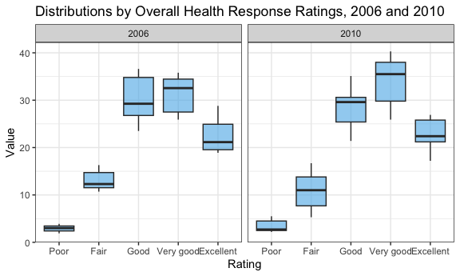

HW3 by AK4598
================
Aleya Khalifa
2023-10-11

# Problem 1

We will explore the `instacart` dataset in this problem. These
anonymized data entail grocery orders from Instacart app users.

The `instacart` dataset has 1,384,617 observations and 15 variables.
Some important identification variables include `order_id`, `user_id`,
and `product_id` - which help to organize the data by app users, their
orders, and the items they ordered. `product_name` includes the names of
the products ordered, and `order_hour_of_day` shows the hour of the day
when the user placed the order.

For example, user 112108 reordered “Bulgarian Yoghurt” as part of an
order that also included celery and cucumbers. Another user (206209) put
in an order at 2pm about 30 days after their prior order, and this
contained bananas, pepsi, dark chocolate, and ice cream.

## Problem 1.1

How many aisles are there, and which aisles are the most items ordered
from?

There are 134 unique types of aisles.

``` r
instacart %>% 
  group_by(aisle_id) %>% 
  summarize(n = n()) %>% 
  nrow()
```

    ## [1] 134

The two aisles from which the most items are ordered from are fresh
vegetables and fresh fruits.

``` r
instacart %>% 
  group_by(aisle) %>%
  summarize(n = n()) %>% 
  filter(min_rank(desc(n)) < 3)
```

    ## # A tibble: 2 × 2
    ##   aisle                 n
    ##   <chr>             <int>
    ## 1 fresh fruits     150473
    ## 2 fresh vegetables 150609

## Problem 1.2

First, create the dataset for a plot that shows the number of items
ordered in each aisle. The data will be limited to those aisles with
more than 10,000 items ordered.

``` r
plot_items <- instacart %>%
  group_by(aisle) %>%
  summarize(n = n()) %>%
  filter(n > 10000) %>%
  arrange(desc(n))
```

Then, plot the number of items ordered in each aisle.

``` r
ggplot(plot_items, aes(x = reorder(aisle, -n), y = n)) + 
  geom_histogram(stat = "identity") + 
  labs(
    title = "Number of items ordered per aisle",
    x = "Aisle",
    y = "Number of items",
  ) + 
  theme_bw() + 
  theme(axis.text.x = element_text(angle = 90))
```


## Problem 1.3

This is a table showing the three most popular items in each of the
aisles, “baking ingredients”, “dog food care”, and “packaged vegetables
fruits”. It shows the number of times each item is ordered in your
table.

``` r
instacart %>%
  filter(aisle == "baking ingredients" | 
           aisle == "dog food care" | 
           aisle == "packaged vegetables fruits") %>%
  group_by(aisle, product_name) %>%
    summarize(num_orders = n()) %>%
  mutate(rank = min_rank(desc(num_orders))) %>%
  filter(rank < 4) %>%
  select(-rank)
```

    ## `summarise()` has grouped output by 'aisle'. You can override using the
    ## `.groups` argument.

    ## # A tibble: 9 × 3
    ## # Groups:   aisle [3]
    ##   aisle                      product_name                             num_orders
    ##   <chr>                      <chr>                                         <int>
    ## 1 baking ingredients         Cane Sugar                                      336
    ## 2 baking ingredients         Light Brown Sugar                               499
    ## 3 baking ingredients         Pure Baking Soda                                387
    ## 4 dog food care              Organix Chicken & Brown Rice Recipe              28
    ## 5 dog food care              Small Dog Biscuits                               26
    ## 6 dog food care              Snack Sticks Chicken & Rice Recipe Dog …         30
    ## 7 packaged vegetables fruits Organic Baby Spinach                           9784
    ## 8 packaged vegetables fruits Organic Blueberries                            4966
    ## 9 packaged vegetables fruits Organic Raspberries                            5546

## Problem 1.4

This is a table showing the mean hour of the day at which Pink Lady
Apples and Coffee Ice Cream were ordered by day of the week.

``` r
instacart %>% 
  filter(product_name == "Pink Lady Apples" | 
           product_name == "Coffee Ice Cream") %>%
  group_by(product_name, order_dow) %>%
  summarize(mean_hour = mean(order_hour_of_day)) %>%
  mutate(day = case_when(
    order_dow == 0 ~ "Sunday",
    order_dow == 1 ~ "Monday",
    order_dow == 2 ~ "Tuesday",
    order_dow == 3 ~ "Wednesday",
    order_dow == 4 ~ "Thursday",
    order_dow == 5 ~ "Friday",
    order_dow == 6 ~ "Saturday",
  )) %>%
  select(product_name, day, mean_hour)
```

    ## `summarise()` has grouped output by 'product_name'. You can override using the
    ## `.groups` argument.

    ## # A tibble: 14 × 3
    ## # Groups:   product_name [2]
    ##    product_name     day       mean_hour
    ##    <chr>            <chr>         <dbl>
    ##  1 Coffee Ice Cream Sunday         13.8
    ##  2 Coffee Ice Cream Monday         14.3
    ##  3 Coffee Ice Cream Tuesday        15.4
    ##  4 Coffee Ice Cream Wednesday      15.3
    ##  5 Coffee Ice Cream Thursday       15.2
    ##  6 Coffee Ice Cream Friday         12.3
    ##  7 Coffee Ice Cream Saturday       13.8
    ##  8 Pink Lady Apples Sunday         13.4
    ##  9 Pink Lady Apples Monday         11.4
    ## 10 Pink Lady Apples Tuesday        11.7
    ## 11 Pink Lady Apples Wednesday      14.2
    ## 12 Pink Lady Apples Thursday       11.6
    ## 13 Pink Lady Apples Friday         12.8
    ## 14 Pink Lady Apples Saturday       11.9

# Problem 2

We will use BRFSS data (`brfss_smart2010`) in this problem.

## Clean the data:

- Format the data to use appropriate variable names

- Focus on the “Overall Health” topic

- Include only responses from “Excellent” to “Poor”

- Organize responses as a factor taking levels ordered from “Poor” to
  “Excellent”

``` r
brfss_smart2010 <- brfss_smart2010 %>%
  janitor::clean_names() %>%
  filter(topic == "Overall Health") %>%
  mutate(response = factor(response, 
                           ordered = TRUE,
                           levels = c("Poor", "Fair", "Good", "Very good", "Excellent")))
```

## Problem 2.1

This table shows which states were observed at 7 or more distinct
locations in 2002 and in 2010. Here, I define “location” as the county.

``` r
brfss_smart2010 %>%
  filter(year == 2002 | year == 2010) %>%
  group_by(locationabbr, year) %>%
  summarize(num_locations = n_distinct(locationdesc)) %>%
  filter(num_locations > 7) %>%
  select(year, locationabbr, num_locations) %>%
  arrange(year, num_locations)
```

    ## `summarise()` has grouped output by 'locationabbr'. You can override using the
    ## `.groups` argument.

    ## # A tibble: 14 × 3
    ## # Groups:   locationabbr [12]
    ##     year locationabbr num_locations
    ##    <int> <chr>                <int>
    ##  1  2002 MA                       8
    ##  2  2002 NJ                       8
    ##  3  2002 PA                      10
    ##  4  2010 OH                       8
    ##  5  2010 MA                       9
    ##  6  2010 NY                       9
    ##  7  2010 NE                      10
    ##  8  2010 WA                      10
    ##  9  2010 CA                      12
    ## 10  2010 MD                      12
    ## 11  2010 NC                      12
    ## 12  2010 TX                      16
    ## 13  2010 NJ                      19
    ## 14  2010 FL                      41

You can see that three states were observed at more than 7 distinct
locations in 2002: MA, NJ, and PA. Another 11 states were observed for
more than 7 distinct locations, as seen in the table.

## Problem 2.2

### Construct a dataset

The dataset `brfss_excellent` is limited to Excellent responses, and
contains, year, state, and a variable that averages the data_value
across locations within a state.

``` r
brfss_excellent <- brfss_smart2010 %>%
  filter(response == "Excellent") %>%
  group_by(year, locationabbr) %>%
  summarize(data_value_avg = mean(data_value)) %>%
  select(year, locationabbr, data_value_avg)
```

    ## `summarise()` has grouped output by 'year'. You can override using the
    ## `.groups` argument.

### Make a “spaghetti” plot

This line graph (or spaghetti plot) uses the `brfss_excellent` dataset
to display the average data value over time by state.

``` r
ggplot(brfss_excellent, aes(x = year, y = data_value_avg, color = locationabbr)) + 
  geom_line() + 
  labs(
    title = "Trends over time, by state",
    y = "State average",
    x = "Year"
  ) + 
  theme(legend.position = "none")
```


## Problem 2.3

### First, create the dataset limited to New York State and the years 2006 and 2010.

``` r
brfss_ny <- brfss_smart2010 %>%
  filter(locationabbr == "NY" & 
           (year == 2006 | year == 2010))
```

### Second, Make a two-panel plot

This plot shows the distribution of `data_value` for overall health
response ratings, from “poor” to “excellent,” for the years 2006 and
2010 in New York State.

``` r
ggplot(brfss_ny, aes(x = response, y = data_value)) + 
  geom_boxplot() + 
  facet_grid(~year) + 
  labs(title = "Distributions by Overall Health Response Ratings, 2006 and 2010",
       x = "Rating",
       y = "Value")
```



# Problem 3

In this problem, we will use accelerometer data from 250 participants.
The data come from the NHANES study.

Note: Variables `*MIMS` are the MIMS values for each minute of a 24-hour
day starting at midnight.

## Problem 3.1

Load, tidy, merge, and otherwise organize the data sets. The final
dataset includes all originally observed variables; exclude participants
less than 21 years of age, and those with missing demographic data; and
encode data with reasonable variable classes (i.e. not numeric, and
using factors with the ordering of tables and plots in mind).

## Problem 3.2

Produce a reader-friendly table for the number of men and women in each
education category, and create a visualization of the age distributions
for men and women in each education category. Comment on these items.

## Problem 3.3

Using your tidied dataset, aggregate across minutes to create a total
activity variable for each participant. Plot these total activities
(y-axis) against age (x-axis); your plot should compare men to women and
have separate panels for each education level. Include a trend line or a
smooth to illustrate differences. Comment on your plot.

## Problem 3.4

Accelerometer data allows the inspection activity over the course of the
day. Make a three-panel plot that shows the 24-hour activity time
courses for each education level and use color to indicate sex. Describe
in words any patterns or conclusions you can make based on this graph;
including smooth trends may help identify differences.
